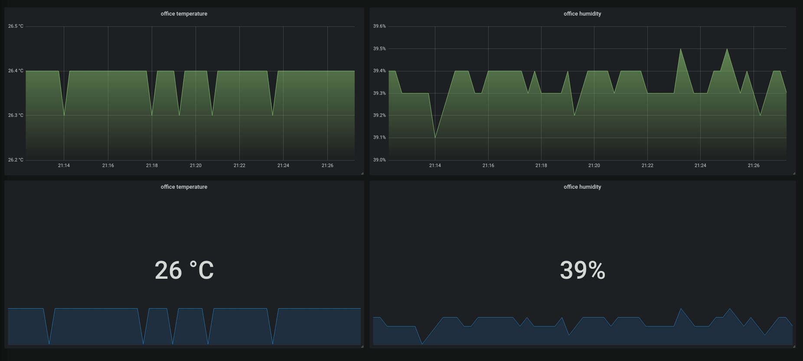
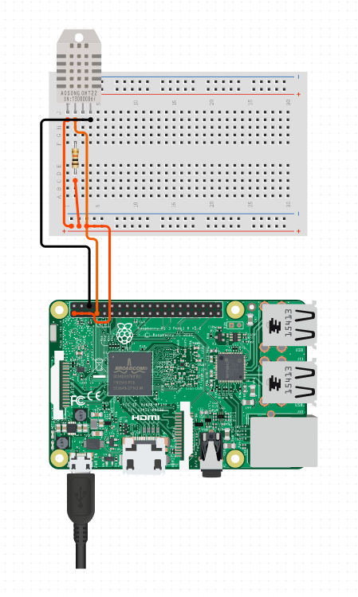

# Monitoring DHT22 with prometheus and grafana





## Wiring DHT22, RPI wiring




## Run setup and start the sensor code as a service

```
./setup.sh
```
* What does this script do ? 
    - install dependencies 
    - move the dht_exporter.service to systemd/system 
    - enable and start the service

* you can check if the metrics are being reported properly by hitting `PI_IP:8001/metrics`
* You should see the metrics in the response 
```
# TYPE dht_temperature gauge
dht_temperature{room="office_room"} 26.4
# HELP dht_humidity Relative Humidity in percent
# TYPE dht_humidity gauge
dht_humidity{room="office_room"} 39.4
```
## Run grafana and prometheus with docker

* Before starting up prometheus make sure to update the PROMETHEUS_IP in the prometheus/targets.json file with the IP of the raspberry pi where the prometheus exporter is running

```
./docker_monitoring.sh
```

* After both of them are running add the prometheus instance as a datasource in grafana.
* Then you should be able to create graphs using those metrics
